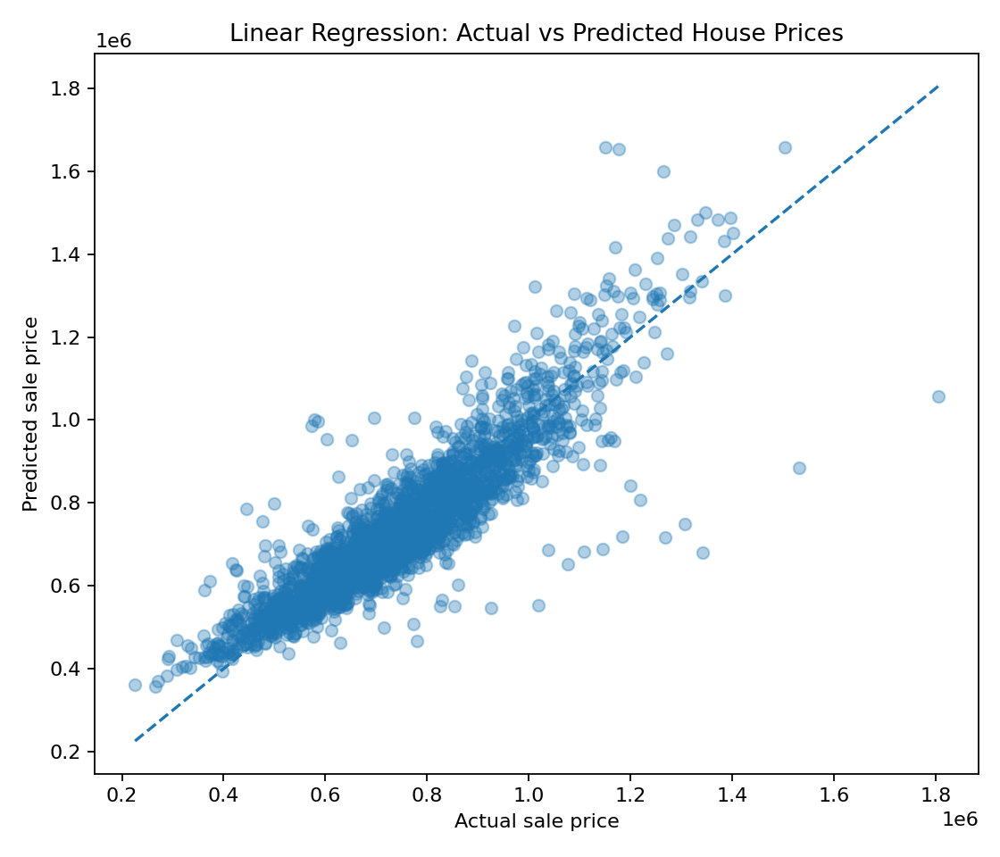
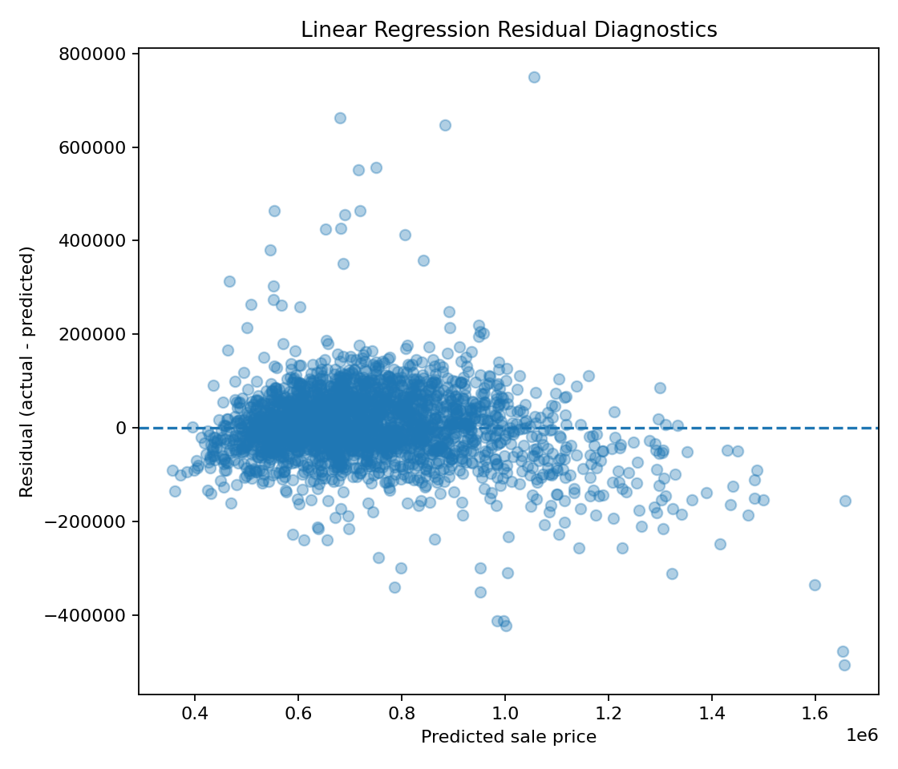
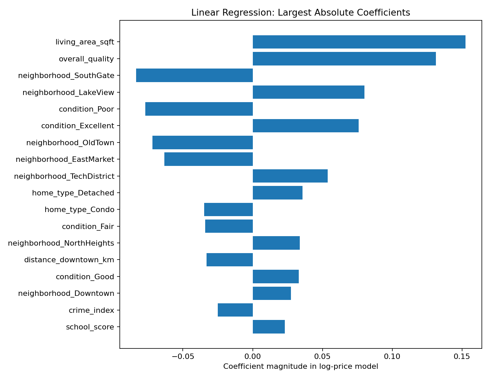
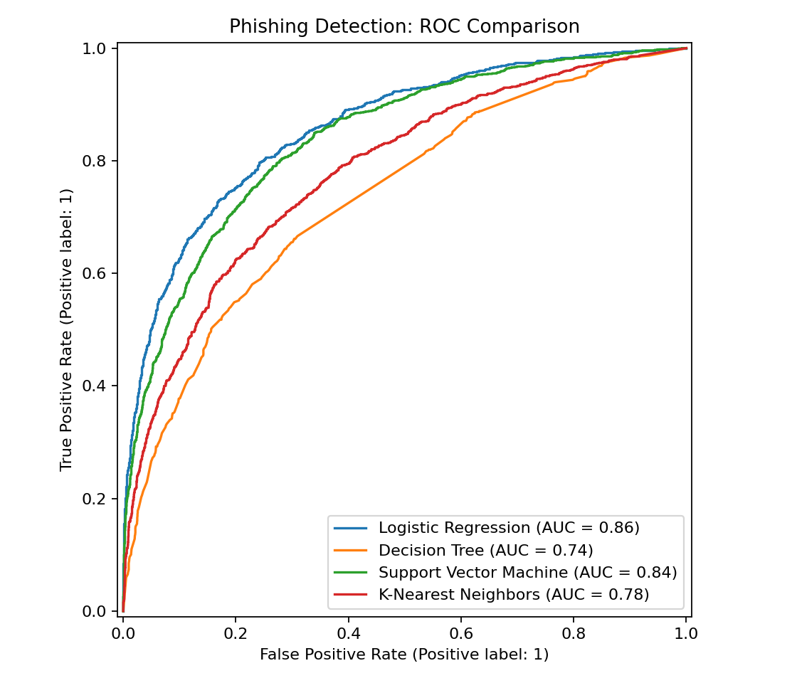
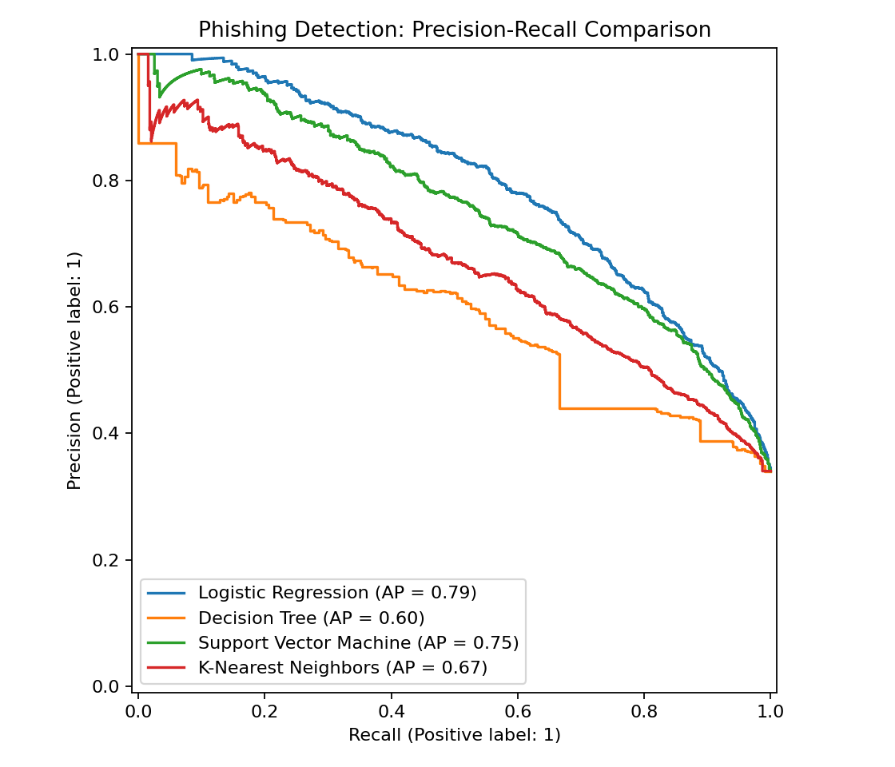
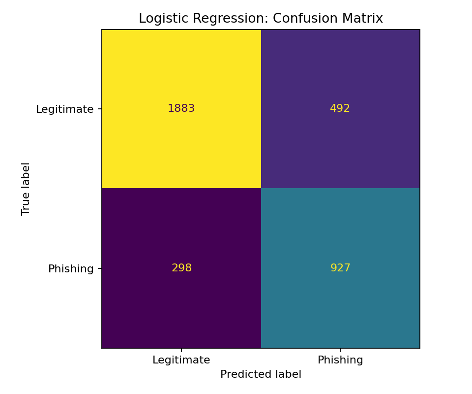
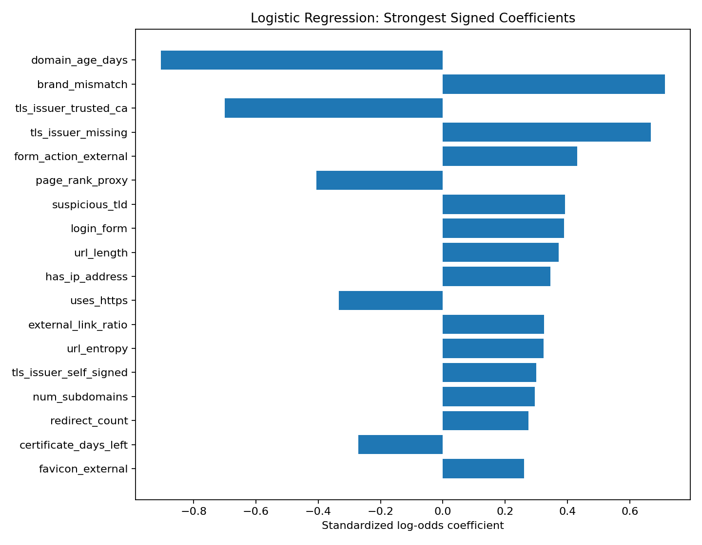
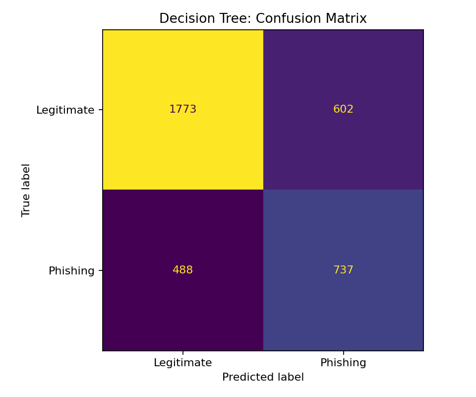
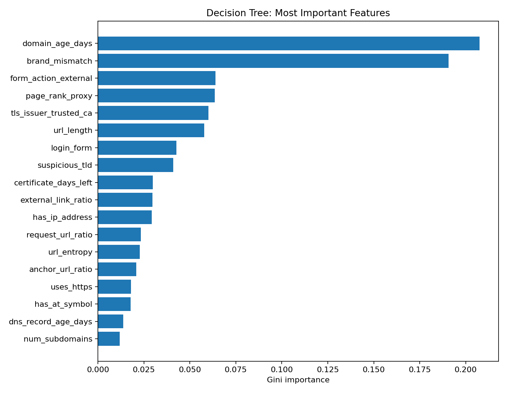
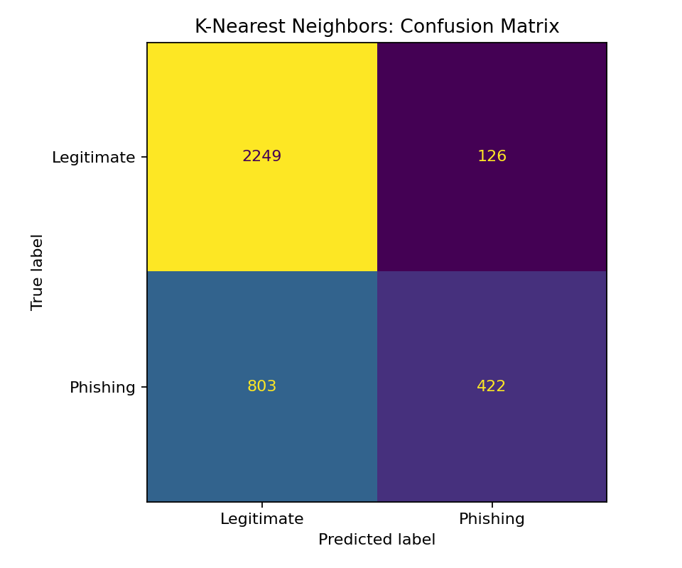

# ML Algorithms Real-World Lab

> **Five classic machine-learning algorithms. Two high-impact problems. One reproducible benchmark.**

[](https://github.com/Saeedam02/ML-Algorithms-RealWorld-Lab/actions/workflows/ci.yml)


This repository turns five foundational ML algorithms into a serious end-to-end
benchmark instead of five isolated toy notebooks.

It covers:

1. **Linear Regression** — predicting urban house sale prices.
2. **Logistic Regression** — phishing website detection.
3. **Decision Tree** — phishing website detection.
4. **Support Vector Machine (RBF)** — phishing website detection.
5. **K-Nearest Neighbors** — phishing website detection.

The classification algorithms are deliberately evaluated on the **same train/test
split and preprocessing pipeline** so their inductive biases can be compared
fairly.

---

## Why these problems?

### 🏠 Problem A — Housing affordability and price prediction

Housing cost remains one of the most visible data problems in urban economics.
The regression benchmark contains **12,000 synthetic property transactions**
with mixed property, neighborhood, infrastructure, energy and macroeconomic
features.

It is intentionally harder than a one-feature straight-line example:

- 19 predictors,
- numeric + categorical variables,
- 1,494 missing cells,
- nonlinear interactions,
- heteroscedastic noise,
- rare luxury/distressed outliers.

### 🛡️ Problem B — Phishing website detection

Phishing detection is a practical cybersecurity problem where false positives
and false negatives both matter. The classification benchmark contains
**18,000 synthetic websites and 30 predictors** based on URL, TLS, domain,
redirect, content and reputation signals.

The benchmark includes:

- mixed numeric + categorical features,
- missing values,
- about **34.0% phishing prevalence**,
- nonlinear interactions,
- 2.5% label noise,
- overlapping classes rather than an artificially separable toy dataset.

> **Data honesty:** both committed datasets are reproducible synthetic
> benchmarks with realistic semantics. They are not claimed to be real people,
> houses, domains, or security incidents. See [`docs/DATASETS.md`](docs/DATASETS.md).

---

# Results

## 1. Linear Regression — House Price Prediction

The model uses median imputation, numeric standardization, categorical one-hot
encoding, a log transform of the target, and ordinary least-squares linear
regression.

| Metric | Test result |
|---|---:|
| R² | **0.799** |
| MAE | **$57,902** |
| RMSE | **$83,701** |
| MAPE | **7.98%** |
| Train rows | 9,600 |
| Test rows | 2,400 |



The residual plot is intentionally not perfect: the benchmark includes
interactions and heavy-tailed transactions that a purely linear model cannot
fully represent.



Coefficient inspection keeps the model interpretable:



Full model card: [`reports/model_cards/linear_regression.md`](reports/model_cards/linear_regression.md)

---

## 2–5. Phishing Classification Benchmark

All four classifiers use the same stratified 80/20 split and the same
train-only preprocessing.

| Algorithm | Accuracy | Precision | Recall | F1 | ROC-AUC | PR-AUC |
|---|---:|---:|---:|---:|---:|---:|
| Logistic Regression | 0.781 | 0.653 | 0.757 | **0.701** | **0.860** | 0.792 |
| Decision Tree | 0.697 | 0.550 | 0.602 | **0.575** | **0.737** | 0.597 |
| Support Vector Machine | 0.774 | 0.656 | 0.703 | **0.679** | **0.839** | 0.752 |
| K-Nearest Neighbors | 0.742 | 0.770 | 0.344 | **0.476** | **0.781** | 0.673 |

### ROC comparison



### Precision–Recall comparison



The results are deliberately interesting rather than artificially perfect:

- **Logistic Regression** is the strongest baseline here because many phishing
  signals contribute additively to risk.
- **RBF SVM** captures nonlinear structure and remains competitive, but costs
  more to train and predict.
- **Decision Tree** is easy to interpret but sacrifices generalization as a
  single tree.
- **KNN** achieves high precision but much lower recall at the default
  probability threshold, exposing a practical local-neighborhood trade-off.

This is exactly why accuracy alone should not be used for security problems.

---

# Algorithm outputs

## Logistic Regression





Model card: [`reports/model_cards/logistic_regression.md`](reports/model_cards/logistic_regression.md)

## Decision Tree





Model card: [`reports/model_cards/decision_tree.md`](reports/model_cards/decision_tree.md)

## Support Vector Machine


Model card: [`reports/model_cards/support_vector_machine.md`](reports/model_cards/support_vector_machine.md)

## K-Nearest Neighbors



Model card: [`reports/model_cards/k_nearest_neighbors.md`](reports/model_cards/k_nearest_neighbors.md)

---

# What the repository teaches

This is not only a collection of `model.fit()` calls. The repository demonstrates:

- realistic train/test discipline,
- mixed-type tabular preprocessing,
- missing-value handling,
- one-hot encoding,
- standardization,
- target transformation,
- stratified splitting,
- class imbalance awareness,
- regression diagnostics,
- confusion matrices,
- ROC and precision-recall analysis,
- model interpretation,
- fit/prediction runtime trade-offs,
- reproducible dataset generation,
- model cards,
- automated tests,
- GitHub Actions CI.

For the mathematics behind every algorithm, read
[`docs/ALGORITHMS.md`](docs/ALGORITHMS.md).

---

# Repository structure

```text
ML-Algorithms-RealWorld-Lab/
├── .github/
│   └── workflows/
│       └── ci.yml
├── data/
│   ├── README.md
│   └── raw/
│       ├── urban_housing.csv
│       └── phishing_websites.csv
├── docs/
│   ├── ALGORITHMS.md
│   ├── DATASETS.md
│   ├── EXPERIMENT_DESIGN.md
│   └── INTERVIEW_CHEATSHEET.md
├── notebooks/
│   ├── 01_linear_regression_housing.ipynb
│   └── 02_classification_phishing.ipynb
├── reports/
│   ├── figures/
│   ├── metrics/
│   ├── model_cards/
│   └── RESULTS.md
├── scripts/
│   ├── generate_data.py
│   └── run_all.py
├── src/
│   └── ml_realworld/
│       ├── experiments/
│       │   ├── classification.py
│       │   └── linear_regression.py
│       ├── config.py
│       ├── data.py
│       ├── evaluation.py
│       ├── models.py
│       ├── plots.py
│       └── preprocessing.py
├── tests/
│   ├── test_data.py
│   ├── test_evaluation.py
│   └── test_smoke.py
├── CHANGELOG.md
├── CITATION.cff
├── CONTRIBUTING.md
├── LICENSE
├── Makefile
├── README.md
├── SECURITY.md
├── pyproject.toml
└── requirements.txt
```

---

# Quick start

## 1. Clone

```bash
git clone https://github.com/Saeedam02/ML-Algorithms-RealWorld-Lab.git
cd ML-Algorithms-RealWorld-Lab
```

## 2. Create an environment

### Windows PowerShell

```powershell
python -m venv .venv
.venv\Scripts\Activate.ps1
```

### Linux/macOS

```bash
python -m venv .venv
source .venv/bin/activate
```

## 3. Install

```bash
python -m pip install -e ".[dev]"
```

## 4. Reproduce every dataset and output

```bash
python scripts/generate_data.py
python scripts/run_all.py
```

Or:

```bash
make data
make run
```

## 5. Run tests

```bash
pytest
```

For coverage:

```bash
pytest --cov=ml_realworld --cov-branch --cov-report=term-missing
```

Lint:

```bash
ruff check .
```

---

# Individual experiments

Run only house-price Linear Regression:

```bash
python -m ml_realworld.experiments.linear_regression
```

Run all phishing classifiers:

```bash
python -m ml_realworld.experiments.classification
```

---

# The five algorithms in one table

| Algorithm | Task | Key assumption / idea | Main preprocessing | Primary output |
|---|---|---|---|---|
| Linear Regression | Regression | target is approximated by linear feature effects | impute, encode, scale, log target | house price |
| Logistic Regression | Classification | linear log-odds boundary | impute, encode, scale | phishing probability/risk |
| Decision Tree | Classification | recursive threshold partitions | impute, encode | phishing class |
| SVM (RBF) | Classification | maximum-margin nonlinear kernel boundary | impute, encode, **scale** | phishing class |
| KNN | Classification | nearby observations have similar labels | impute, encode, **scale** | phishing class |

---

# Dataset provenance and optional real-world extensions

The default data is generated locally so CI never depends on an external API.
For users who want a real-data extension, the documentation points to:

- **Ames Housing / OpenML `house_prices`**, dataset ID `42165`.
- **UCI Phishing Websites**, dataset ID `327`.
- **UCI PhiUSIIL Phishing URL**, dataset ID `967`.

The classic UCI Phishing Websites dataset contains 11,055 instances and 30
features, while PhiUSIIL is a much larger modern phishing benchmark. See
[`docs/DATASETS.md`](docs/DATASETS.md) before adding third-party data.

---

# Reproducibility

The random seed is centralized in:

```text
src/ml_realworld/config.py
```

Changing data generation, preprocessing or model parameters should be followed by:

```bash
python scripts/generate_data.py
python scripts/run_all.py
pytest
```

Then commit the refreshed metrics and figures with the code change.

---

# Limitations

- The committed datasets are synthetic benchmarks, not production datasets.
- Results should not be interpreted as a real cybersecurity detection rate or
  property valuation system.
- No hyperparameter search is used in the baseline benchmark.
- A single Decision Tree is intentionally compared rather than an ensemble such
  as Random Forest or Gradient Boosting.
- SVM and KNN scale less gracefully to very large datasets.
- Classification thresholds are left at each estimator's default decision rule;
  production security systems should tune thresholds against business costs.

These limitations are part of the educational design.

---

# Suggested extensions

Good next steps:

1. Add Ridge/Lasso/Elastic Net to study regularization.
2. Add Random Forest and Gradient Boosting to compare ensembles with one tree.
3. Tune classification thresholds for precision-vs-recall objectives.
4. Add calibration curves.
5. Add SHAP/permutation importance.
6. Add cross-validated hyperparameter search.
7. Add optional adapters for the real UCI/OpenML datasets.
8. Add a Streamlit dashboard for interactive predictions.
9. Benchmark memory and inference latency.
10. Add drift experiments that simulate changes in phishing tactics.

---

# References

- scikit-learn documentation: <https://scikit-learn.org/>
- UCI Phishing Websites dataset: <https://archive.ics.uci.edu/dataset/327/phishing+websites>
- UCI PhiUSIIL Phishing URL dataset: <https://archive.ics.uci.edu/dataset/967/phiusiil+phishing+url+website>
- OpenML Ames Housing (`house_prices`): <https://www.openml.org/d/42165>

---

# License

MIT. See [`LICENSE`](LICENSE).

---

If this repository helps you learn the difference between algorithms rather than
just memorizing APIs, consider giving it a ⭐.
